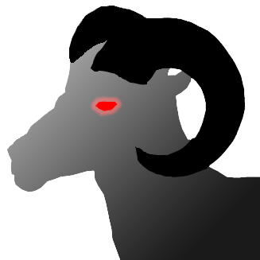

# DnD Tiles

Описание головоломки, на которой основана эта программа, можно прочитать [здесь](assets/puzzle.md).
Ссылки на соавтора:

[Ficbook](https://ficbook.net/authors/4959288)
[Группа в Telegram](https://t.me/Kuzznech1k)

Пользуясь случаем, передаю привет всем людям, которым нравится программирование на языке Python ***и***
фанфики по "Лисьей норе". Пожалуйста, скажите, что я не один такой 😰
## Инструкция для пользователей

### Скачивание и установка

1. Перейдите в раздел **Releases** и скачайте последний релиз.
2. Распакуйте архив. Внутри должны находиться:

   * Исполнительный файл `dnd_tiles.exe` (только для Windows).
   * Файл конфигурации `config.toml`.
3. Для запуска приложения просто дважды кликните на исполнительный файл.

> [!WARNING]
> Консольный интерфейс может отображаться некорректно на некоторых системах.
> Даже в таком случае программа будет читаема.
>
> Возможные варианты исправления:
> * Убедитесь, что консоль использует кодировку UTF-8.
> * Измените размер шрифта в консоли, если символы `▣` или тени кнопок отображаются некорректно.
> * Для Windows рекомендуется запускать через PowerShell или изменить свойства консоли.

### Функционал приложения

* Отображает игровое поле с текущим положением и будущей позицией персонажа.
* Позволяет перемещать персонажа с помощью кнопок на экране или горячих клавиш:

  * Вверх / Вперёд / Вниз / Назад / Влево / Вправо.
  * Случайный шаг с сохранением игровых правил.
  * Перезапуск текущей игры.
  * Выход из приложения.
* Головы персонажей выдают подсказки и описания, включая полезные и случайные (бесполезные) признаки.

### Изменение параметров

1. Откройте файл `config.toml` любым текстовым редактором.
2. Настройте параметры:

   * Размеры поля (`length` и `width`).
   * Вероятности направлений движения (`direction_probabilities`).
   * Полезный признак голов (`useful_trait`).
   * Бесполезные признаки голов (`useless_traits`).
3. Сохраните изменения и перезапустите приложение, чтобы они вступили в силу.

## Инструкция для разработчиков

### Настройка окружения

1. Создайте виртуальное окружение:

```commandline
python -m venv .venv
```

2. Активируйте окружение:

* Linux/macOS:
```commandline
source .venv/bin/activate
```
* Windows: 
```commandline
.venv\Scripts\activate
```

3. Установите зависимости:

```commandline
pip install -r requirements.txt
```

### Сборка исполнительного файла

```commandline
pyinstaller --onefile --console --clean --collect-all textual --collect-all rich --name dnd_tiles --icon assets/icon.ico main.py
```

### Ссылки на документацию используемых библиотек

* [Python](https://docs.python.org/3/)
* [Textual](https://textual.textualize.io/)
* [Rich](https://rich.readthedocs.io/)
* [Tomllib](https://docs.python.org/3/library/tomllib.html)
